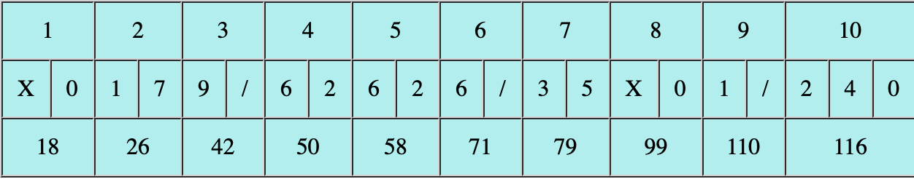

# Bowling_Score_Simulation_Py

Bowling_Score_Simulation_Py is a tutorial of bowling game simulation with Python.

# DEMO

We can get a score table of bowling game simulation result as showed below.



# Features

Bowling_Score_Simulation_Py gives us a table which shows the result of a bowling game simulation　with html file.
The first row shows the number of Frame, the second row shows the number of fallen pins, and third row shows score.

#  Dependency

* random

# Installation

You have only to install Python3.

# Usage

```bash
git clone https://github.com/Sasaken-coder/bowling.git
cd bowling
python3 bowling.py
```

# Note

I don't test environments under Linux.

# Author

* Kenta Sasaki
* kt0sasak1@gmail.com

# License

No license